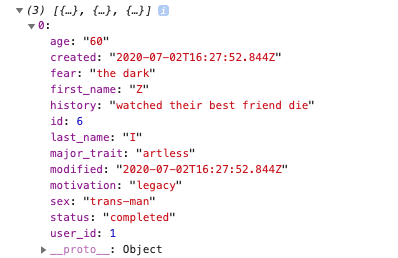
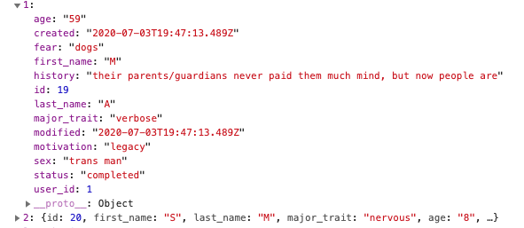

## CHARACTER CREATER API

## API LINK

https://maple-minister-95148.herokuapp.com/

## DOCUMENTATION

* '/api/users/':
    POST: registers/logs in users.

* '/api/characters/' :
    GET: gets a user's characters with all fields with serialization.
    POST: adds a new character linked to the user via user_id.

* '/api/characters/:character_id' :
    GET: gets a specific character for the user with all fields with serialization.
    PATCH: updates a specific character (also used for 'deletion').

* '/api/auth': grants authorization to users so they can fetch their characters.

## SUMMARY

This API was created to help creators have a centralized place to store all their characters and information about them. Included fields are:
  First Name
  Last Name
  Age
  Sex
  Major Trait
  Motivation
  Fear
  History
as of Version 1, with more in the works. All are text.

Required fields are: first_name, last_name, and major_trait.

Authorization is necessary for using the API using JWT, and uses Bearer Token Auth.

## ERRORS

Utilizes standard HTTP respones to indicate success or failure of requests.

## TECH STACK

Node, Express, PostgreSQL, with REST.

## CLIENT INFO

## KARTARA

## SUMMARY

Kartara is an app to help creators keep all of their character information in one place, as well as helping them to create new ones. They can either enter in information for a character they've already created, or generate random prompts to help them round out a character idea. Saved characters can then be updated or deleted as the creator builds and destroys the lives around them.

## TEST USER

user: User
password: P@ssword123

## LINK

https://kartara.sdmccarty.vercel.app

## SCREENSHOTS

Mobile View

Login Page

Homepage

Create Character Page

Save Character Page

Character List Page

Edit Character Page

## TECH STACK

React, React Router, JavaScript, HTML, CSS

## COMPONENTS

* App: App in src/components renders the routes and other components for the application to utilize

* Register: RegistraterPage in src/routes loads the page, with src/components/RegistrationForm loading the form

* Login: LoginPage in src/routes is the landing page for log in, with src/components/LoginForm rendering the actual form for logging in

* Create Character: src/components/CreateCharacter loads the form for creating a new character, with src/components/Utils/GetRandom providing the random data

* Review Character: src/components/ReviewCharacter grabs the new character data for the creater to either save or start again

* Character List: src/components/CharacterList displays a users characters and allows them to view more details about them

* Character Page: src/routes/Character displays the full information available for a character with the option to edit or delete them

* Edit Character: src/components/EditCharacter gives creators the opportunity to edit the information about their characters before saving, canceling, or deleting

* Utils on src/components/Utils provides information for the Private and Public Routes (as well as the Get Random methods mentioned above)

* Context: src/context provides basic context for the app

* Services: src/services has the authorization services needed for page